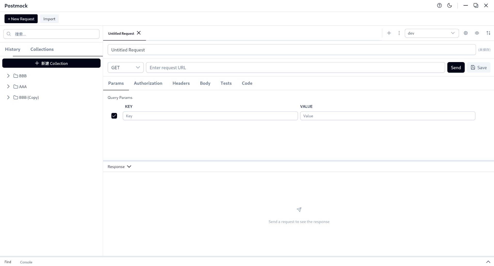

# PostMock

一个现代化的 API 测试工具，基于 Tauri 和 Vue 3 构建的跨平台桌面应用。


<!-- 
TODO: 添加应用截图

-->

## 功能特性

- 🚀 HTTP 请求测试 - 支持 GET、POST、PUT、DELETE、PATCH 等方法
- 📁 集合管理 - 组织和管理你的 API 请求
- 🌍 环境变量 - 支持多环境配置和变量替换
- 📝 请求历史 - 自动记录所有请求历史
- 🧪 自动化测试 - 内置测试断言和全局变量设置
- 🎨 暗色模式 - 支持明暗主题切换
- 💾 数据持久化 - 本地文件系统存储
- 📦 导入导出 - 支持集合的导入和导出
- 🔄 cURL 导入 - 快速从 cURL 命令创建请求

## 技术栈

- **前端框架**: Vue 3 + Vite
- **桌面框架**: Tauri 2
- **UI 组件**: PrimeVue + TailwindCSS
- **状态管理**: Pinia
- **代码编辑器**: CodeMirror 6
- **HTTP 客户端**: Tauri Plugin HTTP

## 下载安装

访问 [Releases](https://github.com/duwei0227/postmock/releases) 页面下载适合你操作系统的安装包：

- **Windows**: `.msi` 或 `.exe`
- **macOS**: `.dmg`
- **Linux**: `.AppImage`、`.deb`、`.rpm` 或 `.flatpak`

或者通过 Flathub 安装（即将推出）：

```bash
flatpak install flathub cn.probiecoder.postmock
```

## 开发环境设置

### 前置要求

- Node.js 18+
- Rust 1.70+
- 系统依赖（Linux）:
  ```bash
  sudo apt-get update
  sudo apt-get install -y libwebkit2gtk-4.1-dev libappindicator3-dev librsvg2-dev patchelf
  ```

### 安装依赖

```bash
npm install
```

### 开发模式

```bash
npm run tauri dev
```

### 构建应用

```bash
npm run tauri build
```

## 使用指南

### 创建请求

1. 点击工具栏的 "New Request" 按钮或使用快捷键 `Ctrl+N` / `Cmd+N`
2. 选择 HTTP 方法（GET、POST 等）
3. 输入请求 URL
4. 配置请求参数、Headers、Body 等
5. 点击 "Send" 发送请求

### 使用环境变量

1. 在环境管理器中创建环境
2. 添加变量，如 `baseUrl = https://api.example.com`
3. 在请求中使用 `{{baseUrl}}/users` 引用变量
4. 切换不同环境快速测试

### 自动化测试

在 Tests 标签页中配置：

- **状态码测试**: 验证响应状态码
- **JSON 字段测试**: 使用 JSONPath 验证响应数据
- **全局变量**: 从响应中提取数据保存为全局变量

### 快捷键

- `Ctrl+N` / `Cmd+N` - 创建新请求
- `Ctrl+S` / `Cmd+S` - 保存当前请求
- `Ctrl+Shift+D` / `Cmd+Shift+D` - 切换主题
- `Ctrl+D` / `Cmd+D` - 复制选中项

## 项目结构

```
postmock/
├── src/                    # Vue 前端源码
│   ├── components/         # Vue 组件
│   ├── stores/            # Pinia 状态管理
│   ├── services/          # 服务层（存储、导入导出）
│   ├── types/             # TypeScript 类型定义
│   └── utils/             # 工具函数
├── src-tauri/             # Tauri 后端
│   ├── src/               # Rust 源码
│   └── icons/             # 应用图标
└── .github/               # GitHub Actions 配置
    └── workflows/         # CI/CD 工作流
```

## 贡献指南

欢迎提交 Issue 和 Pull Request！

1. Fork 本仓库
2. 创建特性分支 (`git checkout -b feature/AmazingFeature`)
3. 提交更改 (`git commit -m 'Add some AmazingFeature'`)
4. 推送到分支 (`git push origin feature/AmazingFeature`)
5. 开启 Pull Request

## 许可证

本项目采用 MIT 许可证。详见 [LICENSE](LICENSE) 文件。

## 作者

- [@duwei0227](https://github.com/duwei0227)

## 相关链接

- [GitHub 仓库](https://github.com/duwei0227/postmock)
- [问题反馈](https://github.com/duwei0227/postmock/issues)
- [发布页面](https://github.com/duwei0227/postmock/releases)
- [更新日志](CHANGELOG.md)

## 致谢

- [Tauri](https://tauri.app/) - 跨平台桌面应用框架
- [Vue.js](https://vuejs.org/) - 渐进式 JavaScript 框架
- [PrimeVue](https://primevue.org/) - Vue UI 组件库
- [CodeMirror](https://codemirror.net/) - 代码编辑器组件
